# Итоговая аттестация Задание 8. 
## Развертывание Apache Airflow в Minikube и создание простого DAG

## Цель: 
Научиться разворачивать Apache Airflow в Kubernetes с использованием Minikube и создавать простой Directed Acyclic Graph (DAG) для автоматизации задач.

## Файлы пректа


## Описание задания и выполнение:

### 1. Запустите Minikube с достаточными ресурсами.
   1. Для того, чтобы настроить Apache Airflow, для minikube нужно выделить 8GB и 4 ядра.

      ```minikube start --driver=docker --memory 8g --cpus 4``` 
        > Exiting due to PROVIDER_DOCKER_VERSION_EXIT_1: "docker version --format <no value>-<no value>:<no value>" exit status 1: error during connect: Get "http://%2F%2F.%2Fpipe%2FdockerDesktopLinuxEngine/v1.46/version": open //./pipe/dockerDesktopLinuxEngine: The system cannot find the file specified.

      ```minikube start --memory 8g --cpus 4```

        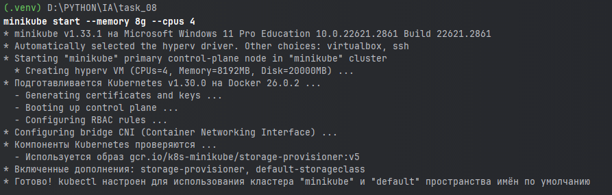

### 2. Установите Helm, если он еще не установлен.
   1. Helm команда для добавления репозитория. ```helm repo add apache-airflow https://airflow.apache.org```
   2. Обновим репозитории ```helm repo update```

        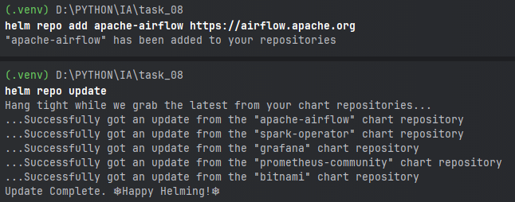

### 3. Добавьте репозиторий Apache Airflow.
   1. Добавим официальный репозиторий Airflow для Helm:

      ```helm repo add airflow https://airflow.apache.org```

        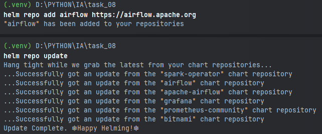

### 4. Создайте DAG и подложите его в git.
   > Airflow в основном оперирует только DAG. Вкратце — это код на Python, который запускается по времени. Может запускаться как скрипт, может запускаться как докер-образ. Что так, что так, результат будет плюс-минус один и тот же.
   >
   > Если рассматривать первый вариант — то после развертывания локального AirFlow необходимо будет вручную каждый раз подкладывать DAG. Это не самое лучшее решение, и вот почему —
   >
   > 1. Каждый раз придется копировать код DAG в контейнер и перезапускать под
   >
   > 2. Такая операция требует очень много памяти
   >
   > Если рассматривать второй вариант, то он попроще и поудобнее, и даже чем-то похож на CI/CD. Так получилось, что AirFlow из коробки поддерживает соединение с git.
   >
   > Таким образом, мы можем положить код в репозиторий git и радоваться жизни. Давайте попробуем.
  1. Создаем git https://github.com/alneo/data1T_task_08_airflow
  2. Файлы тут тоже представлены в каталоге dags 

### 5. Используем Helm для развертывания Airflow с базовыми настройками.
  1. Установка Airflow с указанием пространства имен

         helm install airflow apache-airflow/airflow \
          --debug \
          --namespace airflow \
          --create-namespace \
          --set dags.gitSync.enabled=true \
          --set dags.gitSync.repo=https://github.com/alneo/data1T_task_08_airflow.git \
          --set dags.gitSync.branch=main \
          --set dags.gitSync.subPath="/"  

  2. Посмотрим на происходящее в неймспейсе airflow

        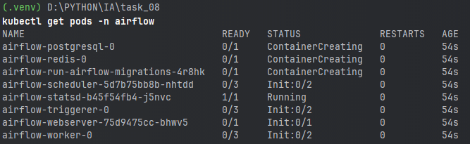
        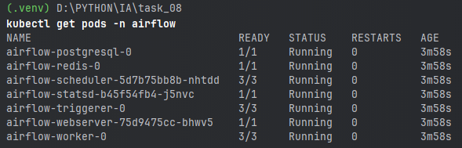

### 6. Получите URL для доступа к веб-интерфейсу Airflow.
  1. Пробросим порты для доступа к веб-интерфейсу Airflow
    
    ```kubectl port-forward svc/airflow-webserver 8888:8080 --namespace airflow```

  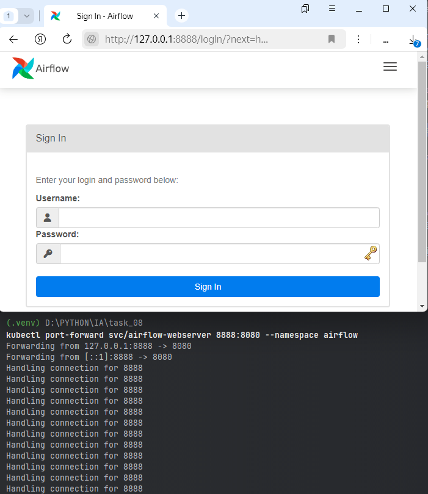

### 7. В DAG создайте 2 любых оператора. Запуск DAG — ежедневный в 12:45 по Москве.
  - В решении указано время 13:05 (хотел проверить работу вживую), в файлах потом указал 12:45 (schedule_interval='45 12 * * *' - тут используется формат cron минуты, часы, дни, месяцы, года)
  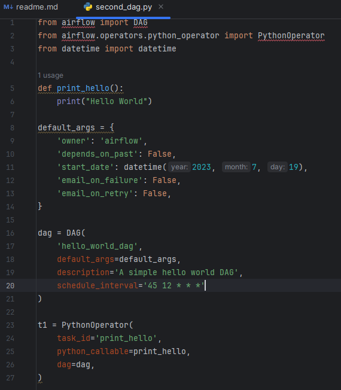

## В качестве решения 
Необходимо сделать отчет, в котором видно Ваш DAG в git, а также видно DAG в Airflow. Обязательно сделайте скрин вашего DAG в работе, что он отбежал.

  - Удалим все поды namespace airflow, для того чтобы все изменения вступили в силу(менял файлы на git)

    ```kubectl delete pods --all -n airflow```
  - операция достаточно долгая, так как в этот же момент создаются и запускаются поды вместо этих.
  - После того как все поды получат статус Running запускаем ```kubectl port-forward svc/airflow-webserver 8888:8080 --namespace airflow```
  - Смотрим в WEB интерфейс, рассматривал ситуацию в моменте(указал время, чтобы увидеть запуск)
  - WEB интерфейс AirFlow просмотр всех DAG
  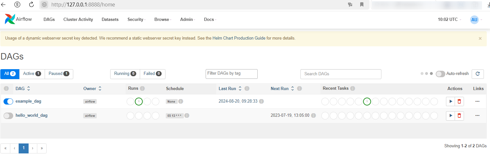
  - WEB интерфейс AirFlow просмотр всех DAG время 13:03
  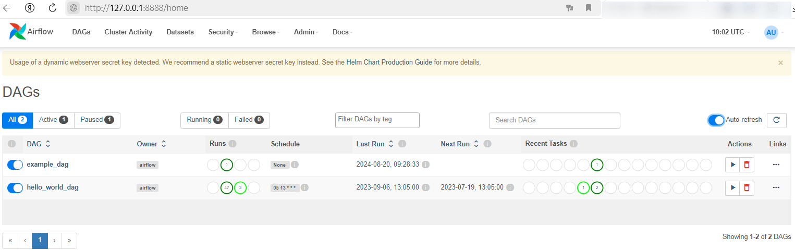
  - WEB интерфейс AirFlow просмотр DAG hello_world время 13:03
  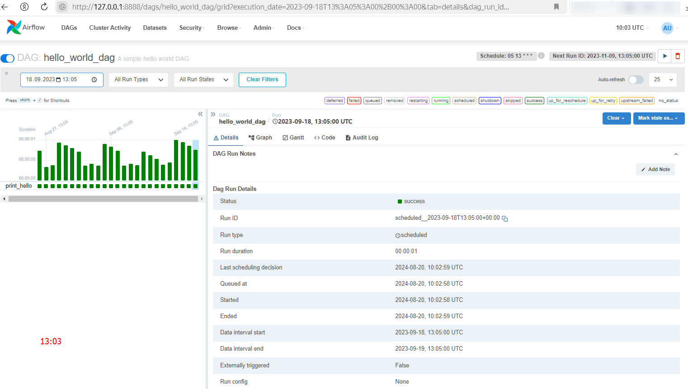
  - WEB интерфейс AirFlow просмотр DAG hello_world время 13:04
  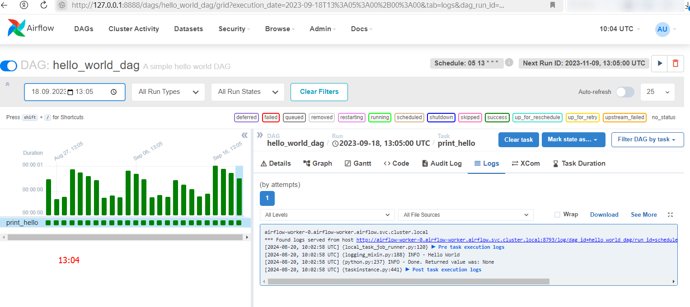
  - WEB интерфейс AirFlow просмотр всех DAG время 13:05 - запущен
  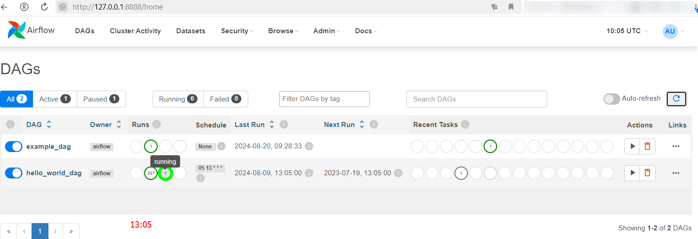
  - WEB интерфейс AirFlow просмотр DAG hello_world время 13:06 - информация о запуске
  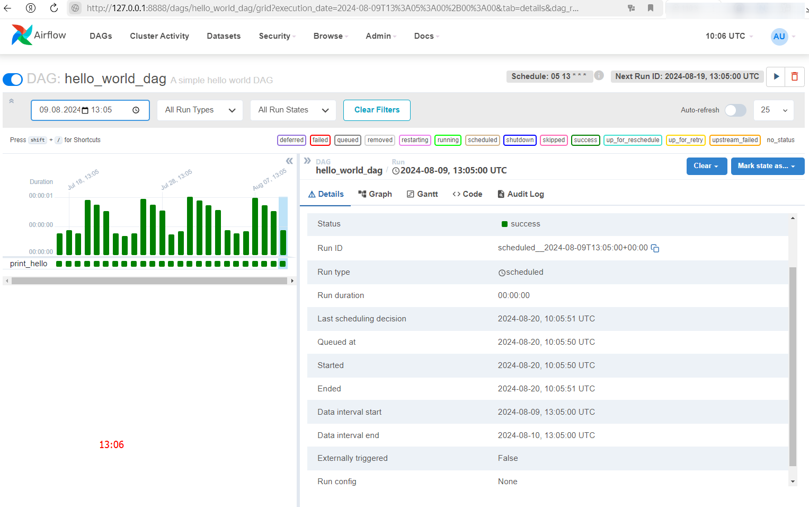
  - WEB интерфейс AirFlow просмотр DAG hello_world время 13:07 - подробная информация о запуске
  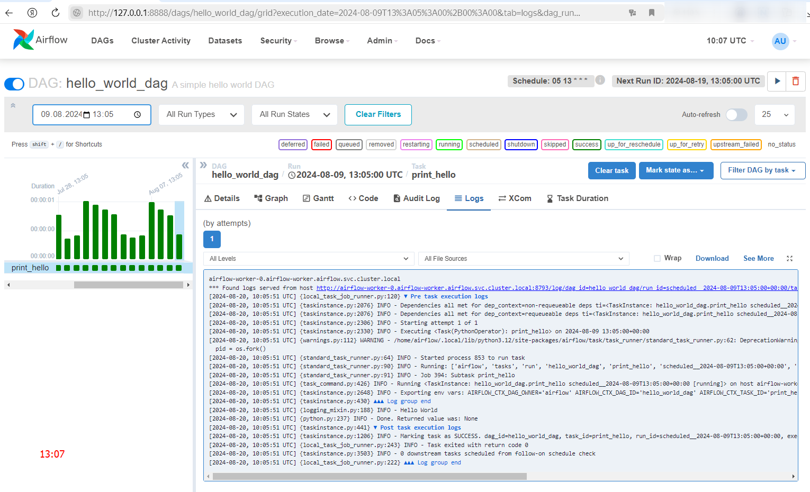


  > **ВЫВОД**
> 
  > DAG — это ориентированный ациклический граф, концептуальное представление серии действий или, другими словами, математическая абстракция конвейера данных (data pipeline).
> 
  > Хотя оба термина, DAG и data pipeline, используются в разных сферах, они представляют собой почти идентичный механизм. В двух словах, DAG (или конвейер) определяет последовательность этапов выполнения в любом неповторяющемся алгоритме.
> 
  > Аббревиатура **DAG** расшифровывается так:
  > 
> DIRECTED — направленный. В общем, если существует несколько задач (тасков), каждая из них должна иметь по крайней мере одну материнскую (предыдущую) или дочернюю (последующую) задачу. Возможно, предыдущих или последующих задач будет больше одной. (Однако важно отметить, что существуют также DAG, которые имеют несколько параллельных задач, что означает отсутствие зависимостей между параллельным задачами.)
> 
  > ACYCLIC — ациклический. Ни одна задача не может создавать данные, которые будут ссылаться на самих себя. Это может создать проблему бесконечного цикла. В DAG нет циклов.
> 
  > GRAPH — граф. В математике граф представляет собой конечный набор узлов с вершинами, соединяющими узлы. В контексте разработки данных каждый узел в графе представляет собой задачу. Все задачи изложены в четкой структуре, с дискретными процессами, происходящими в заданных точках, и прозрачными взаимосвязями с другими задачами.
> 
  > **Когда нужны DAG?**
> 
  > Создание кода рабочего процесса вручную снижает производительность инженеров, и это одна из причин, по которой существует множество полезных инструментов для автоматизации процесса, таких как Apache Airflow. Первым шагом к эффективной автоматизации является осознание того, что DAG может быть оптимальным решением для перемещения данных практически в любой области, связанной с вычислениями.
> 
  > “В Astronomer мы считаем, что использование инструмента конвейера данных на основе кода, такого как Airflow, должно являться стандартом”, - говорит Кентен Данас, ведущий разработчик в Astronomer.
> 
  > Конвейеры, основанные на коде, чрезвычайно динамичны. Если вы можете написать это в коде, то вы можете сделать это в своем конвейере данных.
> 
  > Конвейеры на основе кода обладают большими возможностями расширения. Вы можете интегрироваться практически с любой существующей системой, если у нее есть API.
> 
  > Конвейеры на основе кода более управляемы: поскольку все находится в коде, он может легко интегрироваться в ваш CI / CD управления версиями и общие рабочие процессы разработчика.


## Результат задания
После выполнения задания у вас будет развернутая в Minikube среда Apache Airflow, где вы сможете создавать и управлять DAG для автоматизации задач. 